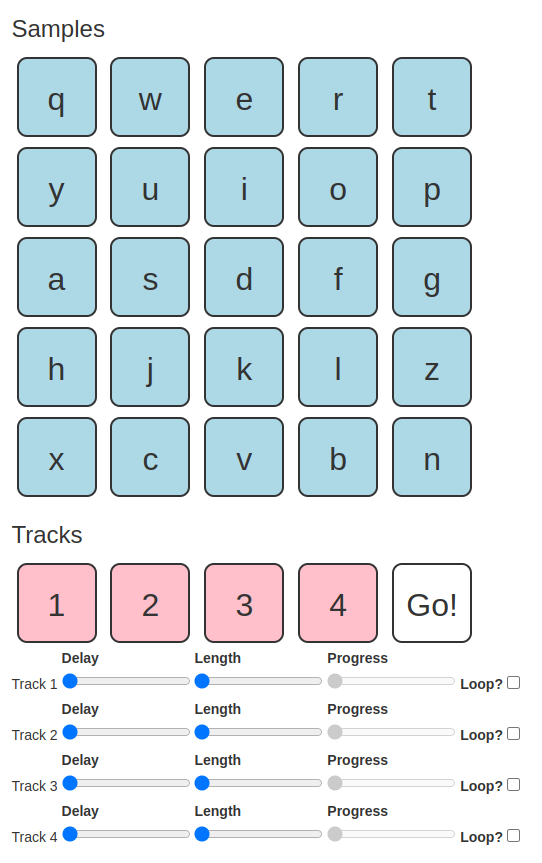

Hack-A-Day is a project I'm doing in November, where I try to make 30 new projects, in 30 days.

# Day 15: Hack-A-Sound

This is a sound mixing toy.

Demo available [here](https://tilde.za3k.com/hackaday/line).

Source available on [github](https://github.com/za3k/day13_line).

# Credits

- Built-in and generated soundboard sounds due to [jsfxr](https://sfxr.me/) [[source](https://github.com/chr15m/jsfxr)].
